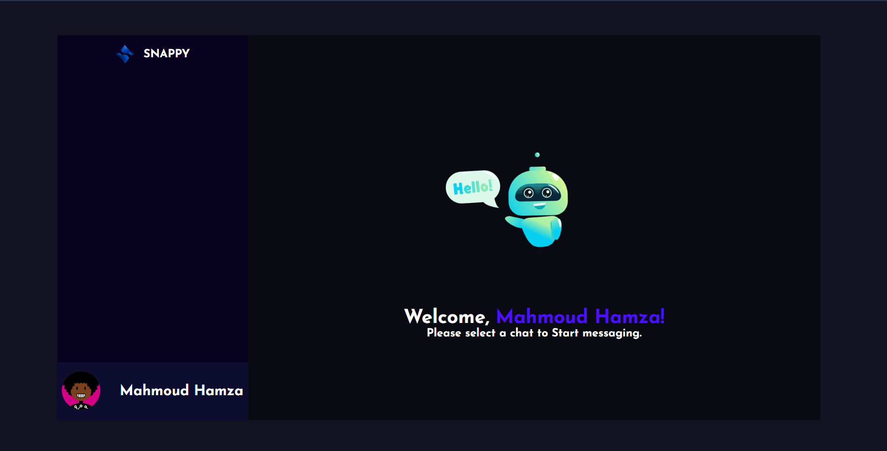
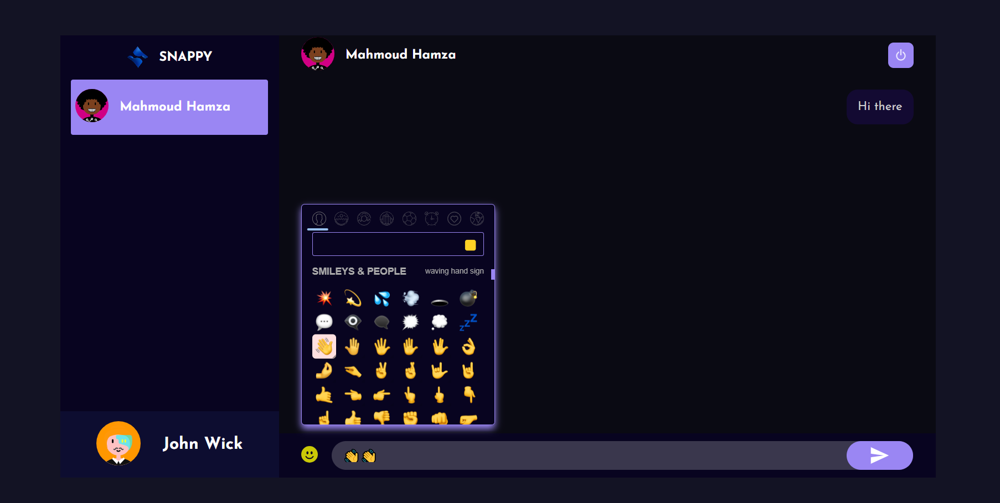

# Snappy - Chat Application

Snappy is a chat application using MERN Stack.






### How to run it

- clone the repo

```shell
git clone https://github.com/Mahmoud-Hamza-Git/realtime-chatapp
cd realtime-chatapp
```

- Rename the rename env files from .env.example to .env

```shell
cd public
mv .env.example .env
cd ..
cd server
mv .env.example .env
cd ..
```

- Change the MongoURL in the `.env` file with your mongoDB connection string.

```JavaScript
Mongo_URL="mongodb+srv://MongoDBConnectionStringExample/SnappyChat"
```

- Now install the dependencies

```shell
cd server
yarn
cd ..
cd public
yarn
```

- Now just start the development server.

For Frontend.

```shell
cd public
yarn start
```

For Backend.

Open another terminal in the app folder

```shell
cd server
yarn start
```

- Finally open `localhost:3000` in your browser.
